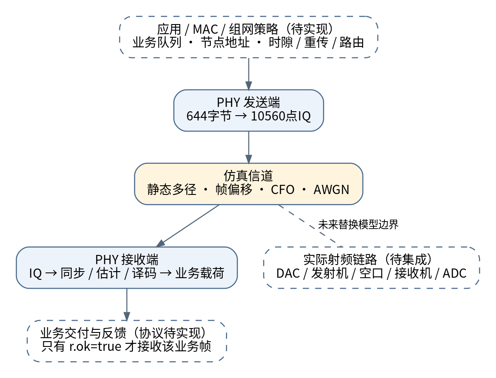
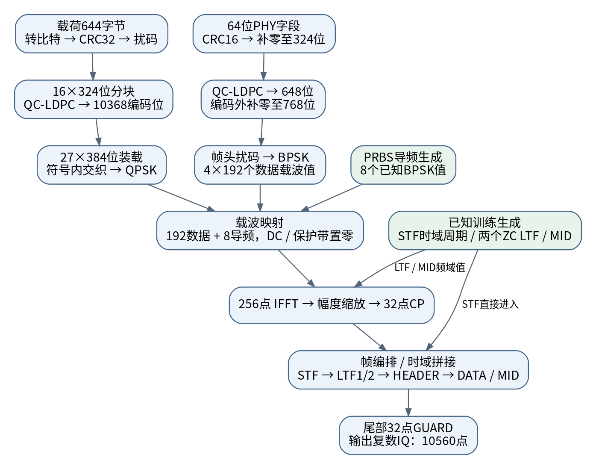
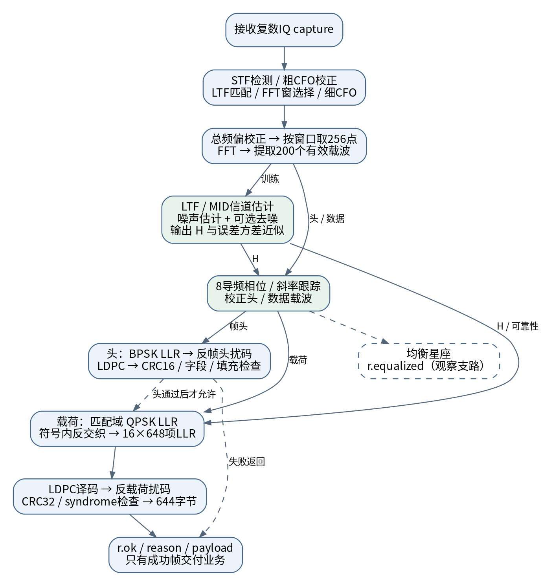

# COFDM 基带整体链路架构

版本：v1基线架构说明，2026-09-28。适用目录：`matlab/`；目标硬件：Zynq-7020。

后续新增了v2实验分支：1个BPSK头符号、1～2048字节载荷，详见 [IP承载与可变长度帧设计](IP承载与可变长度帧设计.md)。本文的644字节、4符号头和固定帧图均指保留的v1，不是v2参数。

本文回答三个问题：一帧业务数据如何变成发射IQ、接收IQ如何恢复业务数据、每个模块负责什么。内容以当前代码为准，将已实现模型、可选算法和后续硬件/组网规划分别标明。

## 1. 系统边界与总览

当前工程的v1基线是一套单天线、单链路、固定帧格式的 COFDM 物理层模型。发送端接收644字节载荷，产生复数IQ采样；接收端从包含噪声、多径和频偏的IQ中找帧、恢复比特，并用LDPC与CRC判断是否接收成功。

COFDM中的“编码”对应LDPC纠错，“OFDM”对应多子载波调制。CRC检测残余错误，扰码改善比特统计特性，交织分散相邻错误；它们承担不同职责，不能互相替代。



图中实线框表示当前模型，虚线框表示未来硬件或协议层。仿真信道并不等同于完整射频链路。业务载荷可以承载未来MAC报文，但当前代码不会解释节点地址、选择路由、分配时隙或执行重传。

| 层次 | 负责的工作 | 当前状态 |
|---|---|---|
| 应用与网络 | 业务数据、节点地址、路由和转发 | 未实现；演示用随机载荷 |
| MAC与组网控制 | 入网、接入竞争/时隙、收发切换、ACK与重传 | 未实现；尚无连续多节点协议 |
| PHY发送 | 加保护、调制、插入训练、生成IQ | 已实现 |
| 信道模型 | 静态整数时延多径、恒定频偏、偏移、AWGN | 已实现上述项 |
| PHY接收 | 同步、FFT、信道/相位估计、软解调、纠错及CRC | 已实现，有多个算法分支 |
| FPGA与射频 | 实时采样、流控、DAC/ADC、上下变频、功放/低噪放 | 有规划和测试向量，尚无本PHY的RTL综合验证 |

## 2. 关键参数与一帧长什么样

| 参数 | 当前值 | 含义 |
|---|---|---|
| 采样率 | 15.36 MS/s | 每秒1536万对复数I/Q样本 |
| FFT / CP | 256 / 32 | 每个普通OFDM符号共288样本 |
| 子载波间隔 | 60 kHz | 15.36 MHz ÷ 256 |
| 有效符号 / CP时长 | 16.667 / 2.083 μs | 普通OFDM符号总时长18.75 μs |
| 有效载波 | 200 | 有符号编号-100…-1、1…100；DC空置 |
| 数据 / 导频 | 192 / 8 | 用于帧头和载荷符号；LTF/MID使用全200载波 |
| 帧头调制 | BPSK | 使用独立保护的PHY参数头 |
| 载荷调制 | QPSK | 每个数据符号384个编码比特 |
| 纠错码 | QC-LDPC (648,324) | 每324信息位编码为648位，码率1/2 |
| 业务载荷 | 644字节 | 不含载荷CRC32与PHY帧头 |

帧内顺序如下；方括号表示符号数量，并非代码数组索引。

```text
STF → LTF1 → LTF2 → HEADER[4]
    → DATA[8] → MID → DATA[8] → MID
    → DATA[8] → MID → DATA[3] → GUARD
```

| 部分 | 长度（复采样点） | 主要职责 |
|---|---:|---|
| STF短训练 | 160 | 发现帧候选、估计粗频偏；周期16、重复10次 |
| 两个ZC长训练 | 2×288=576 | 精确定时、细频偏、初始全带宽信道估计 |
| 保护帧头 | 4×288=1152 | 传递版本、profile、载荷长度、序号等 |
| 数据 | 27×288=7776 | 发送16个载荷LDPC码字 |
| 中间训练MID | 3×288=864 | 在第8、16、24个数据符号后刷新信道 |
| 帧后GUARD | 32 | 当前模型填零保护，不能当成已验证的射频切换时间 |

有效帧10528点，加GUARD共10560点，对应687.5 μs。每帧业务信息5152 bit，理想帧净速率约7.494 Mbps。这里未扣除MAC报头、TDD换向、重传、反馈及调度空闲，所以不是自组网业务吞吐承诺。

CP主要为多径超额时延及截窗误差留裕量，不是用来限制直线通信距离。MID是完整已知训练符号；导频是夹在普通符号中的8个已知载波，两者不是同一机制。

## 3. 发送端整体流程



发送端有载荷和帧头两条比特支路，以及已知训练序列支路。它们最终由帧编排器按固定顺序组成时域采样。源码入口为 `+cofdm/tx.m`。

### 3.1 载荷支路：业务字节到QPSK

| 模块 | 输入 → 输出 | 职责与当前实现 |
|---|---|---|
| 字节转比特 | 644字节 → 5152 bit | 按每字节MSB优先展开，双方必须保持位序一致 |
| CRC32 | 5152 → 5184 bit | 追加32位校验，接收端检测译码后的残余错误 |
| 扰码 | 5184 → 5184 bit | PRBS7逐位异或，种子93；改善序列统计，不提供加密 |
| 分块 | 5184 → 16×324 bit | 将数据切成16个LDPC信息块 |
| QC-LDPC编码 | 16×324 → 16×648 bit | 添加冗余，使接收端有能力纠正部分错误 |
| 符号装载 | 10368 → 27×384 bit | 连续码字流按OFDM符号重新分组 |
| 符号内交织 | 每组384 bit → 重排384 bit | 固定仿射地址置换，分散部分邻近错误 |
| QPSK映射 | 每2 bit → 1个复符号 | 输出每符号192个数据载波值，归一化平均符号能量 |

编码块与OFDM符号不是一一对应关系：一个LDPC码字648 bit，每个数据符号承载384 bit，因此码字可能跨越符号边界。接收端必须先反交织并恢复连续比特顺序，再每648个LLR组成译码块。

### 3.2 帧头支路：先让接收端确认这是什么帧

帧头有64位字段：version、profile、payload_bytes、sequence、payload_codewords和flags。当前接收机已知固定profile，用帧头确认格式、长度和序号；它还不能根据任意收到的MCS字段切换到不同调制或码率。

```text
64位字段 → CRC16后80位 → 补244个零至324位
→ LDPC后648位 → 编码外补120位至768位
→ 帧头扰码（种子31） → BPSK → 4个OFDM符号
```

帧头扰码发生在编码和填充之后，载荷扰码发生在LDPC编码之前，接收端需要按各自的逆序处理。帧头后置扰码也可避免大量填零位映射为同相BPSK造成过高峰值。帧头没有使用载荷的384位交织器。

### 3.3 导频、训练与OFDM调制

| 模块 | 负责什么 | 实现文件 |
|---|---|---|
| 导频生成 | 产生随符号索引变化的8个已知BPSK值，供接收端估计残余相位 | `pilot_values.m`、`prbs.m` |
| 载波映射 | 将192数据值和8导频放到256点频率网格，DC及保护带置零 | `tx.m`、`ofdm_symbol.m` |
| IFFT | 把并行子载波复符号变成256个时域复采样 | `ofdm_symbol.m` |
| 幅度缩放与CP | IFFT采用酉尺度，再乘txScale=0.25；复制末32点放到符号前 | `ofdm_symbol.m` |
| STF生成 | 12个间隔16的载波产生16点时域周期，重复10次 | `training.m` |
| 双ZC LTF | 长度201、根25/29，删去中心元素映射200载波，再IFFT及加CP | `training.m`、`ofdm_symbol.m` |
| MID生成 | 重用LTF1频域序列；全带宽已知训练，不承载业务比特 | `tx.m` |
| 帧编排 | 按STF、LTF、头、数据、MID顺序拼接，最后加GUARD | `tx.m` |

STF是独立生成的重复波形，没有普通OFDM符号的额外32点CP。ZC经过DC打孔和载波映射后，不能直接沿用完整ZC序列的理想恒包络/自相关结论。

最终输出 `wave` 为10560×1的复数列向量。未来送入DAC之前还需要落实采样接口、量化、插值/滤波和射频增益控制；这些不是当前 `tx.m` 已实现的硬件模块。

## 4. 信道模型：发送波形如何被破坏

`+cofdm/channel.m` 对发送波形依次加入静态整数时延多径、帧前采样偏移、恒定载波频偏和复高斯白噪声。多径增益会归一化，SNR按接收有效帧平均复采样功率定义。

| 现象 | 会造成什么 | 由谁主要处理 |
|---|---|---|
| 初始帧偏移 | 接收机不知道帧从哪里开始 | STF检测、LTF匹配与窗口选择 |
| 载波频偏CFO | 星座随时间旋转，严重时产生子载波间干扰 | 粗/细频偏估计与逐采样校正 |
| 多径 | 不同子载波幅相不同，可能形成深衰落 | CP、安全FFT窗口、信道估计和均衡 |
| AWGN | 扰动幅度与相位，形成软判决不确定性 | 估计去噪、可靠性LLR、LDPC |

模型返回 `truth` 供测试脚本核对；接收函数只接收IQ、公开配置和码矩阵，不使用真实信道、真实帧起点或真实SNR辅助恢复。当前未实现SFO、时变多径、分数时延、PA非线性和完整干扰模型。

## 5. 接收端整体流程



接收端分为三条相互协作的路径：同步控制路径决定在哪里取符号；训练/导频路径估计信道和相位；数据路径输出LLR并译码。`+cofdm/rx.m` 负责组织这些模块，并优先验证帧头。

### 5.1 获取一帧：检测、频偏与FFT窗口

| 步骤 | 模块职责 | 关键输出 |
|---|---|---|
| STF检测 | 对延迟16点的IQ做64点滑动相关与归一化能量门控，寻找持续相关区间 | 帧候选位置 |
| 粗CFO | 用重复STF的相关相位估计较大频偏 | coarseCfoHz及粗校正波形 |
| LTF匹配 | 在候选附近用已知LTF1匹配搜索，确认长训练位置 | 相关峰、ltfPeakStart |
| FFT窗选择 | 按接收模式使用最强峰、路径能量簇或估计安全区间中部 | ltfUsefulStart |
| 细CFO | 对两LTF分别FFT并除去各自已知序列，比较信道估计相位 | fineCfoHz |
| 总频偏校正 | 将粗细频偏合并，对原始采样作复旋转 | corrected波形 |

STF理论粗CFO无模糊范围约±480 kHz，双LTF细估计约±26.667 kHz；这些是公式范围，不是已保证的捕获性能。两个ZC根不同，因此必须消除已知序列后再比较，不能直接把两LTF当作相同的重复时域序列。

当前同步器用整个capture的能量最大值做相对门控，并且只尝试第一个STF候选，属于离线/整帧缓存参考。未来流式接收还需要AGC有效指示、在线噪声门限、失败重搜和超时恢复状态机。

`sync.frameStart` 仍是由最强匹配峰推算的帧参考；在多径及窗口调整模式下，实际取FFT的位置是 `sync.ltfUsefulStart`。业务层不能将前者直接当作已经校准的首达径时间戳。

### 5.2 提取符号、FFT与初始信道估计

接收机从选定的有效符号位置提取256点并做FFT，普通符号间隔为288点。这在功能上完成了CP去除，但源码没有独立的 `remove_cp.m`；提取位置推进体现在 `rx.m` 的 `get_fft` 和 `pos` 中。

两个LTF用于估计每个有效子载波的复信道：H1=Y1/X1、H2=Y2/X2，初始估计为二者平均。噪声估计来自两次估计之差；假设相邻训练间信道近似不变，且残余频偏已经较小。

`estimate_channel.m` 再按接收模式选择原始LS、时延结构投影或相位居中的FIR去噪。输出包括200点信道估计H及可选的信道误差方差近似。H不仅用于均衡，也用于导频可靠性加权与LLR缩放。

### 5.3 先接收帧头

```text
4个头符号FFT → 导频相位校正 → BPSK软解调
→ 反帧头扰码 → 取前648个LLR → LDPC译码
→ CRC16、字段和填充检查 → 允许进入载荷接收
```

后120个编码外填充槽不进入LDPC译码。译码得到的324信息位中，前80位用于CRC16验证，后244个填充位必须为零。若LDPC、CRC或固定profile字段检查失败，接收函数返回失败，不继续输出一个被视为有效的业务帧。

### 5.4 载荷处理：相位、均衡和软信息

| 模块 | 职责 | 为什么需要 |
|---|---|---|
| 导频相位跟踪 | 用8个已知导频估计公共相位和频率方向相位斜率 | 修正剩余相位旋转及小量线性相位误差 |
| 相位补偿 | 对有效载波按估计相位旋转 | 让星座与解调参考对齐 |
| 信道均衡 | 用H补偿多径引起的频率选择性幅相变化 | 不同子载波经历的衰落不同 |
| 软解调LLR | 为每个编码比特给出倾向及可靠程度 | LDPC需要可靠性，而非只有0/1硬判决 |
| MID更新 | 数据第8、16、24符号后，用已知训练重估H | 避免整帧只依赖开头的信道估计 |

当前代码的星座观察值为 `conj(H)Y/(abs(H)^2+有效噪声)`。实际QPSK LLR直接从 `conj(H)Y` 的实部、虚部及有效噪声计算，并不先对深衰落载波做不稳定的除H操作。FPGA实现时可以保留LLR主路径，将显示星座所用除法与实时译码解耦。

正LLR表示更倾向比特0，负LLR更倾向1，绝对值表示置信度。部分模式在有效噪声中加入信道误差方差近似，避免过度相信带噪的信道估计；该近似尚未完整覆盖ISI、ICI、相位误差和干扰。

导频斜率校正不等于持续采样时钟恢复，尚无SFO重采样环路。MID目前每次重新估计并替换H，尚未实现跨MID时间滤波或利用未来MID的双向插值。

### 5.5 从LLR恢复业务数据

```text
27×384个LLR → 符号内反交织 → 连续10368个LLR
→ 按648分16块 → LDPC译码 → 16×324信息位
→ 反载荷扰码 → CRC32检查 → 644字节业务载荷
```

LDPC采用分层归一化最小和译码，归一化因子0.75、最多12轮，可用syndrome提前结束。可选消息量化与信道FIR定点是独立配置；启用 `compact_fixed` 不会自动启用LDPC消息量化。

当前 `r.ok` 要求CRC32正确且16个载荷码字的syndrome全部通过。测试脚本还会核对恢复载荷是否逐字节等于发送数据。失败时 `r.payload` 可能仍包含译码候选值，调用者必须检查 `r.ok`，不能仅凭payload非空就上交业务。

## 6. 训练、导频与校验机制如何配合

| 机制 | 放在哪里 | 主要解决什么 | 不负责什么 |
|---|---|---|---|
| STF | 帧开始 | 包检测、粗频偏 | 不提供完整200载波的精细信道估计 |
| 两个LTF | STF之后 | 定时、细频偏、初始全带宽H | 不保证整帧时变信道可持续跟踪 |
| 导频 | 每个头/数据符号的8个载波 | 低维相位跟踪 | 不能独立恢复CP范围内任意时变多径 |
| MID | 数据区固定位置 | 全带宽H刷新 | 不承载业务、不推进载荷比特地址 |
| LDPC | 头及载荷编码块 | 纠正一定范围内的比特错误 | 不能弥补完全漏检或严重错窗 |
| CRC | 头CRC16、载荷CRC32 | 检测残余错误，辅助拒绝坏帧 | 不直接纠错，不是身份认证 |

头符号与数据符号共享连续的导频符号计数；MID也推进该计数，但自身使用完整LTF1序列。收发双方若对MID是否推进计数理解不一致，后续导频将错位。

## 7. 接收算法版本与定点边界

| 模式 | 主要特点 | 使用定位 |
|---|---|---|
| baseline | 最强峰窗口、LS、相位展开加权拟合 | 默认可重现基线 |
| proposed | 时延结构去噪、误差感知LLR、33点圆周搜索 | 较高计算量的性能参考 |
| safe_window | proposed加路径能量簇窗口 | 窗口算法消融 |
| compact | 能量簇窗口、7抽头FIR、9点圆周搜索 | 低复杂度浮点候选 |
| compact_center | compact加估计安全区间居中窗口 | 可选实验；收益有退化，不替换默认 |
| compact_fixed | 居中窗口、FIR逐级定点、导频ROM量化 | 局部定点研究与RTL对拍入口 |

此外还有delay、delay_uncertainty、compact_channel和compact_fir5，用于分离各项算法变化的影响。模式由 `receiver_config.m` 选择，均使用相同空口帧格式。

已实现的FIR局部定点采用18位/14小数位数据、18位/16小数位系数及26位累加参考，明确半LSB远离零舍入和饱和。导频仅量化搜索ROM。ADC/AGC、FFT、同步分数、NCO、噪声估计、导频运算及LLR生成仍未完成整链定点。

## 8. 配置、函数接口与数据所有权

| 入口/输出 | 类型或规模 | 含义 |
|---|---|---|
| `config()` | 配置结构体c | 固定PHY参数、训练、位序、门限及位宽配置 |
| `receiver_config(c,mode)` | 接收配置结构体 | 选择算法，不改变当前TX空口格式 |
| `ldpc_code()` | 码矩阵及索引 | 编码器、译码器共享的QC结构 |
| `tx(payload,seq,c,code)` | 输入644字节；输出wave和meta | seq为0…65535；meta保存码位及离散采样PAPR |
| `channel(wave,c,p)` | 输出y与truth | y给接收机；truth只给测试评价 |
| `rx(y,c,code)` | 输出结构体r | 成功标志、失败原因、载荷及同步/译码诊断 |
| `r.codedLLR` | 成功进入载荷时10368项 | 已恢复码字顺序的软信息，便于模块对拍 |
| `r.iterations`、`r.syndromeOk` | 各16项 | 每个载荷码字的迭代次数及校验状态 |
| `r.channelSaturations` | 计数 | 仅已执行的信道定点更新阶段饱和，不是全RX统计 |

接收结构体字段按处理进度逐步产生。同步或帧头失败时，不应假定后续LLR、CRC或迭代字段一定存在。`r.reason` 用于区分同步/范围、头部、格式和载荷失败。

## 9. 未来映射到 Zynq-7020

下表是规划，不代表已经有这些RTL模块。原则是把连续采样和硬实时计算放在PL，把策略与包管理放在PS。

| 位置 | 建议模块 | 设计重点 |
|---|---|---|
| PS处理器 | 参数配置、包队列、统计、未来MAC/路由与速率策略 | 不承担持续满速LDPC的默认实现 |
| PL发送 | CRC/PRBS、LDPC编码、交织映射、训练ROM、IFFT、CP | 帧头与载荷路径的控制与地址对齐 |
| PL接收 | STF/LTF、NCO、符号缓存、FFT、H估计、导频、LLR、LDPC | 最坏周期、位宽、饱和和流控 |
| PL控制 | 帧状态机、时间戳、收发使能、错误恢复 | 需要明确时钟域和valid/ready边界 |
| DMA/DDR接口 | 业务包及调试IQ传输 | 使用FIFO和描述符，不让PS轮询逐样本 |
| 射频接口 | ADC/DAC或射频收发器的数据口、增益与时钟 | 实际器件及接口工程尚待集成 |

半双工情况下可以研究FFT/IFFT核复用；仍须计算重配置、仲裁和收发换向时间。训练ROM、复乘、CORDIC及倒数单元可分时复用，但各模块的突发峰值不能只用全帧平均吞吐估计。

主要缓存包括：采样/捕获缓存、256点符号缓存、200点信道缓存、384项交织/反交织缓存、648项LLR码字队列及业务包FIFO。导频校正需要先取得导频估计，因此通常需要保留本符号数据；LDPC跨OFDM符号组块也需要队列。

当前648码每槽需要处理1个头码字和16个载荷码字。按既有理想周期预算，9路并行、12轮不足以持续满速，27路QC是综合候选；这不是已测资源结论。低复杂度FIR减少了信道估计运算，但LTF匹配与LDPC仍是重点。

## 10. 当前能做什么，以及组网还缺什么

当前可做端到端数字仿真、同IQ算法对照、部分定点研究，以及TX和FIR模块的测试向量导出。已有CRC、LDPC、同步和载荷一致性验证，但没有RF灵敏度、实距吞吐或整链FPGA结果。

| 未来自组网能力 | PHY需要提供的支持 | 当前缺口 |
|---|---|---|
| 时隙接入/TDD | 可校准RX时间戳、定时TX、确定性收发切换 | 只有仿真帧位置，尚无全网时基和时隙控制 |
| 多节点识别 | 承载节点/网络标识的可靠控制报文 | 现有PHY序号不等于节点地址 |
| ACK与重传 | 成功/失败事件、包标识、反馈帧与超时接口 | CRC存在，ACK/ARQ尚未实现 |
| 自适应速率 | 可信链路质量、多个可运行MCS、切换确认 | 目前仅固定QPSK 1/2；高阶MCS仍为规划 |
| 接入与冲突恢复 | 连续检测、忙闲判定、重搜、冲突处理 | 当前只尝试首个STF候选，非连续流MAC |
| 安全通信 | 密钥、身份认证、加密与防重放 | 扰码和CRC不提供这些能力 |

因此，整体工程应由“可复现PHY → 定点与实时接口 → 射频单链路 → MAC接入与反馈 → 多节点组网”逐步衔接。当前算法优化集中在前两个阶段的模型部分。

## 11. 阅读代码与运行入口

建议先读 `config.m → tx.m → synchronize.m → rx.m`，了解主数据流，再读 `estimate_channel.m / track_pilots.m / ldpc_decode.m`。`run_demo.m` 展示一次完整收发调用。

在项目根目录MATLAB中运行：

```matlab
addpath('matlab');
r0 = run_demo('baseline');
r1 = run_demo('compact');
r2 = run_demo('compact_fixed');
```

基础回归位于 `tests/run_tests.m`；算法回归为 `run_receiver_tests`、`run_compact_tests` 和 `run_fixed_tests`。PER对照脚本为 `run_receiver_comparison`、`run_compact_comparison`、`run_fixed_comparison`。它们是测试入口，不是发送或接收数据路径模块。

`export_vectors.m` 导出发送波形、码字和映射；`export_receiver_vectors.m` 导出局部定点FIR及ROM向量。后者不代表全部RX已支持RTL对拍。

## 12. 相关详细文档

- [PHY详细设计](PHY设计.md)：位序、CRC、训练与精确参数。
- [算法深化设计](算法深化设计.md)：算法不足与研究顺序。
- [低复杂度接收机设计](低复杂度接收机设计.md)：FIR、路径簇与搜索量预算。
- [局部定点与窗口优化](局部定点与窗口优化.md)：位宽、舍入及整数参考。
- [FPGA实现规划](FPGA实现规划.md)：模块调度、LDPC周期、接口与资源约束。
- [最新局部定点验证](../results/FIXED_RECEIVER.md)：实际结果及退化情况；不能用设计目标替代实测结论。
